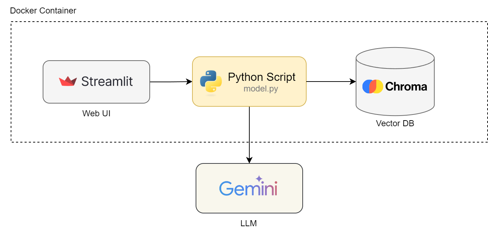

# Article Unraveler

An end-to-end chat based app that helps users research online articles throught Q&A. This app processes links of articles entered by the user and uses **Retrieval-Augmented Generation (RAG)** to generate answers to user's questions.

## Table of Contents

* [Key Features](#key-features)
    * [Demo](#demo)
* [System Architecture](#system-architecture)
    * [Component Overview](#component-overview)
    * [Component Details](#component-details)
* [End-to-End Flow](#end-to-end-flow)
    * [Preprocessing](#preprocessing)
    * [Querying](#querying)
* [Deployment](#deployment)
    * [Docker Compose Deployment](#docker-compose-deployment)
* [Evaluation](#evaluation)
    * [Dataset](#evaluation-dataset)
    * [Results](#evaluation-results)


## Key Features

- **Powerful Language Understanding**: Utilizes Gemini LLM for language comprehension.
- **Accurate Responses**: Chroma vector DB is utilized for storing processed content from articles to help the LLM get context and generate accurate responses. The retriever, temperature and chunk size params are selected through experiments and grid search.
- **User-Friendly Interface**: Interactive and intuitive UI built with Streamlit.

### Demo

Watch the demo video below to see this app in action:

[article-unraveler-demo-2.webm](https://github.com/LostInCode404/article-unraveler/assets/15314796/70b128f6-c916-4254-a0fa-227506d90f1e)


## System Architecture

### Component Overview

The system is composed of three main components:
1. **Gemini LLM**: Handles natural language processing and understanding. 
2. **Chroma Vector DB**: Stores and retrieves vector representations of chunked data from articles.
3. **Streamlit UI**: Provides an interface for users to submit queries and view results.

&nbsp;<br>



### Component Details

#### 1. Gemini LLM

The default model is `gemini-1.5-flash`, which is configurable in `.env` file.

#### 2. Chroma Vector DB

Chroma DB is used as a vector store which indexes chunks of data generated from articles entered by the user. This helps the LLM generate accurate queries.

#### 3. Streamlit UI

Streamlit UI takes the user input and uses the LLM to generate results.


## End-to-End Flow

### Preprocessing

1. **User Input**: User enters the links to articles that they want to analyze.
2. **Load Articles**: Load content using the URLs.
3. **Chroma Vector DB Indexing**: Split the loaded data into chunks and index them in the Vector DB.
&nbsp;<br>
&nbsp;<br>


### Querying

1. **User Input**: Users enters the question in the input box.
2. **Query Vector DB**: Query the Vector DB to find chunks matching the user question and retrieve the top 5 chunks.
3. **Generate Prompt**: Generate prompt containing the retrieved chunks from the Vector DB. The prompt contains instructions to generate failure message if the user question is not related to the given articles.
4. **Generate Response**: Send the prompt to the LLM to generate response. 
&nbsp;<br>
&nbsp;<br>


&nbsp;<br>

## Deployment

#### Docker Compose Deployment 

Make sure you update `GOOGLE_API_KEY` in the `.env` file in project root. 

```shell
# Start app
docker-compose up -d --build

# Stop app
docker-compose down
```

## Evaluation

### Evaluation Dataset

#### Data Source
Generated dataset using [Ragas](https://docs.ragas.io/en/stable/) based on these articles from Nature:
- [How cutting-edge computer chips are speeding up the AI revolution](https://www.nature.com/articles/d41586-024-01544-0)
- [The AI revolution is coming to robots: how will it change them?](https://www.nature.com/articles/d41586-024-01442-5)
- [How does ChatGPT ‘think’? Psychology and neuroscience crack open AI large language models](https://www.nature.com/articles/d41586-024-01314-y)
- [Lethal AI weapons are here: how can we control them?](https://www.nature.com/articles/d41586-024-01029-0)
#### Dataset
- Generated dataset: [csv: [nature_questions.csv](./eval/nature_questions.csv)] [pkl: [nature_testset.pkl](./eval/nature_testset.pkl)]
- Total questions after cleaning: 72
    - Simple: 37
    - Reasoning: 17
    - Multi-context: 18

### Evaluation Results

Evaluated the RAG workflow with different retrievers, temperatures and chunk sizes to select the best performing configuration. The parameters for grid search were selected based on standalone experiments. 

Considerations for selecting grid search parameters:
- **Temperature**: Low temperatures were giving better scores. Selected `1e-8` and `0.2` for grid search.
- **Splitter Params**: In standalone experiments, small (~600) and large (~4000) chunk sizes  were performing worse than values in 1000 to 2000 range. Selected `(1000,200)` and `(2000,300)` as `(chunk_size,chunk_overlap)` pairs for grid search.
- **Retriever**: Experimented with these retrievers:
    - **Single query**: No processing, use plain query provided by the user.
    - **Multi query**: LangChain's [MultiQueryRetriever](https://python.langchain.com/v0.1/docs/modules/data_connection/retrievers/MultiQueryRetriever/) uses an LLM to generate multiple queries from different perspectives for a given user query. It then retrieves documents for each generate query and takes union.
    - **Lord of the Retrievers (LOTR)**: LangChain's [MergerRetriever](https://python.langchain.com/v0.2/docs/integrations/retrievers/merger_retriever/) combines results from multiple retrievers and ranks them. I used it with retrievers from three embeddings: Google `models/embedding-001`, HuggingFace `BAAI/bge-large-en` and SentenceTransformer `sentence-transformers/all-mpnet-base-v2`.
    - **LOTR with multi-query**: LOTR with multi query was giving only slightly better results than others at a very high processing and time cost which did not seem worth the cost. Did not include it in grid search.

Results table:

|  S/N  | retriever   |   chunk_size |   chunk_overlap |   temperature |   overall_context_precision |   overall_faithfulness |   overall_answer_relevancy |   overall_context_recall |
|---:|:------------|-------------:|----------------:|--------------:|----------------------------:|-----------------------:|---------------------------:|-------------------------:|
|  1 | single      |         1000 |             200 |         1e-08 |                    0.986111 |               0.808685 |                   0.700714 |                 0.979861 |
|  2 | single      |         1000 |             200 |         0.2   |                    0.986111 |               0.808503 |                   0.68545  |                 0.979861 |
|  3 | multi       |         1000 |             200 |         1e-08 |                    0.986111 |               0.809149 |                   0.70568  |                 0.979861 |
|  4 | multi       |         1000 |             200 |         0.2   |                    0.986111 |               0.790195 |                   0.68824  |                 0.979861 |
|  5 | lotr        |         1000 |             200 |         1e-08 |                    0.986111 |               0.818833 |                   0.687792 |                 0.979861 |
|  6 | lotr        |         1000 |             200 |         0.2   |                    0.986111 |               0.819125 |                   0.673784 |                 0.979861 |
|  7 | single      |         2000 |             300 |         1e-08 |                    0.986111 |               **0.866527** |                   **0.722277** |                 0.979861 |
|  8 | single      |         2000 |             300 |         0.2   |                    0.986111 |               0.854845 |                   0.716443 |                 0.979861 |
|  9 | multi       |         2000 |             300 |         1e-08 |                    0.986111 |               0.787749 |                   0.675628 |                 0.979861 |
| 10 | multi       |         2000 |             300 |         0.2   |                    0.986111 |               0.763988 |                   0.656184 |                 0.979861 |
| 11 | lotr        |         2000 |             300 |         1e-08 |                    0.986111 |               0.827612 |                   0.720494 |                 0.979861 |
| 12 | lotr        |         2000 |             300 |         0.2   |                    0.986111 |               0.845993 |                   0.716848 |                 0.979861 |
